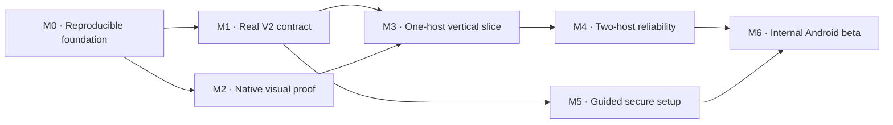

# Native OpenCode companion — delivery plan

Planning baseline: 2026-09-26. Owner and final technical authority: Carter McCann.

This plan maps work; it does not claim implementation or authorize cloud resources or changes to real working repositories. On 2026-09-27 Carter authorized a public open-source repository under `comcreate-io`; Carter selected GPLv3 (`GPL-3.0-only`); the license decision is closed. Confirmed product choices are distinguished from proposed implementation defaults. Routine reversible implementation work can proceed once its milestone is authorized; do not repeatedly ask for decisions already made.

## 1. Outcome and scope

From an Android phone, Carter can select a computer and project, continue an OpenCode session, give instructions, inspect changes, answer permission requests and return later without losing the thread or accidentally issuing work twice.

The application is a native OpenCode client, not a second agent runtime. Each host is authoritative for its sessions and execution. A host switch does not transfer files or migrate an active run.

| Commitment | Status |
|---|---|
| Kotlin with Jetpack Compose; Android initial delivery | Confirmed |
| OpenCode V2 UI/UX is the primary source | Confirmed |
| T3 patterns may inform implementation; copying is optional | Confirmed |
| Swift/iOS only if coworkers request it | Confirmed, deferred |
| Multi-machine access, easy maintenance and reliable setup | Confirmed |
| Cloudflare Tunnel is the preferred remote-access candidate | Proposed; prove auth + streaming in M1 |
| Single-user, bring-your-own-machines; no service account required for the app itself | Proposed initial scope |
| Debug/internal APK for initial use | Proposed; signing/distribution choice before M6 |

### Included in the first usable beta

Machine setup and diagnostics; project/session selection; new and existing sessions; text prompts; supported agent/model selection; streaming conversation and tool status; durable drafts; permission and question responses; interrupt; read-only file/diff review; offline cached state; recovery after foregrounding/process death; two-host isolation; light/dark UI and accessibility.

Simple file references and slash commands are included only for the subset proved in M1 and exposed by the host. Full composer fidelity includes their placement; unsupported actions must be explicitly unavailable. Image attachments, a full shell/terminal and advanced worktree management are deferred to keep the first beta bounded.

### Explicitly deferred

iOS, team accounts, billing, hosted relay, automatic cloud provisioning, push notifications, background execution on the phone, cross-machine session transfer, full code editor, arbitrary terminal, repository mutations from a Git UI, voice, general provider credential management, V1 compatibility and a plugin marketplace. New scope enters through a decision and a milestone, not an incidental component.

## 2. Requirements and acceptance

| ID | Requirement | Acceptance evidence | Milestone |
|---|---|---|---|
| R01 | Native V2 visual identity | Reviewed phone screenshots of all core states in light/dark; Compose implementation | M2 |
| R02 | Machine isolation | Two hosts with colliding project/session identifiers; drafts/actions never cross | M4 |
| R03 | Setup that explains failures | Clean-machine install and connection walkthrough; auth, offline and version errors distinct | M5 |
| R04 | Session workflow | Real disposable project: list/create/open, prompt, model/agent selection and interrupt | M3 |
| R05 | Correct transcript recovery | Replay/reconcile after stream loss and process death; no missing or duplicated durable content | M3–M4 |
| R06 | Safe send intent | Persist-before-dispatch; unknown result retained; ack cleanup cannot resend | M3–M4 |
| R07 | Reliable approvals/questions | Pending requests reloaded; stale/double response handled; exact host/request preserved | M4 |
| R08 | Useful changes view | File list + unified diff, binary/large/no-Git/no-change cases; no hidden write actions | M4 |
| R09 | Honest lifecycle/offline state | Cached reading works; network reachability never substitutes for authenticated readiness | M3–M4 |
| R10 | Protected remote access | HTTPS, auth, credential storage, revocation/rotation behavior and no secret logs verified | M1, M5 |
| R11 | Accessible and responsive | Large text, TalkBack, keyboard, touch targets and long-history benchmark evidence | M2, M6 |
| R12 | Maintainable delivery | Reproducible build, CI checks, compatibility manifest, upgrade/rollback and release notes | M0, M6 |

Detailed test cases live in [Verification](docs/VERIFICATION.md); every requirement needs evidence, not just a checked task.

## 3. Delivery sequence

M1 and M2 are independent after M0. M5 can start once M1 settles the auth boundary, but its final walkthrough uses the integrated app. Do not estimate dates before M1's protocol/auth unknowns and the first native build are measured.

### M0 — Reproducible foundation

Deliver: smallest Android project, Gradle wrapper/checksum, version catalog, pinned Nix shell and lock, documented SDK licenses/toolchain setup, formatter/lint/test tasks, CI build skeleton, fixture/evidence directories and compatibility-manifest format. Use the small module split in Architecture. Exclude research clones and local secrets/build outputs from version control.

Exit: clean checkout builds a debug APK in the documented shell; one meaningful state test and basic device/emulator launch pass; exact commands and tool versions recorded. If Nix/Android SDK tooling fails, solve the dev shell rather than installing global tools. Application ID can be temporary in a disposable prototype; settle it before distributing builds.

Progress (2026-09-26): the scaffold, pinned shell, wrapper, catalog, CI skeleton and compatibility manifest exist. Local formatting, four client state tests, Android lint and debug/unsigned release assembly passed; `:protocol:test` had no sources. The isolated emulator booted and the debug APK installed and cold-launched. A fresh source export with no project build output assembled successfully. M0 local exit evidence is complete; fresh remote CI remains unobserved. The thin M2 synthetic proof awaits phone-layout review; M1 has a runtime-validated admission/replay subset, with full integration gates open. See [M0 evidence](docs/evidence/M0/REPORT.md).

### M1 — Prove the real OpenCode V2 contract

Deliver: isolated upstream release installation and disposable repository; protocol fixtures with provenance; capability matrix; auth decision; recorded results for health/session/prompt/stream/history/permissions/questions/interrupt/files/diffs. Confirm whether the chosen release matches the researched development source. Test duplicate prompt IDs, a lost response after acceptance, sequence replay boundaries and durable versus transient events.

Exit: select an exact supported release/build, document observed behavior and implement the smallest typed adapter needed for M3. No guessed endpoints or fallback-to-success. If a release lacks required replay/auth facilities, select another tested release or propose a bounded workaround with tests; do not hide incompatibility. Do not run agent actions on Carter's real projects.

Progress (2026-09-26): official 1.18.32 passed ten isolated admission/replay case groups, including dropped-response reconciliation and restart. Strict Kotlin JSON/SSE decoding and real fixtures are implemented. A subsequent loopback model fixture proved execution, text replay, read/question tools, active interrupt and basic diff reads; a separate permission probe exercised simultaneous replies. Read-only Kotlin HTTPS transport now passes local TLS fixture tests. Full transcript integration, persistence and remote auth integration remain open. [Transport evidence](docs/evidence/M1/transport/REPORT.md). [Execution evidence](docs/evidence/M1/execution/REPORT.md). [M1 report](docs/evidence/M1/REPORT.md).

Auth decision: test built-in access first. A private direct endpoint may support the technical spike. The supported remote path requires authenticated HTTPS and a documented revocation story. If shared server credentials cannot meet per-device revocation, explicitly choose an MVP rotation/re-pair limitation or a small gateway; do not silently promise both simplicity and a feature the server lacks.

### M2 — Native visual proof

Deliver: Compose previews/debug-only fixture screens for machines, sessions, conversation/composer, expanded tool detail, approval/question, changes and connection failure. Use the actual V2 source tokens and source component mapping in [UX](docs/UX.md). Keep fixture transport out of release variants.

Exit: Carter reviews phone layouts including keyboard-open, light/dark, large text and a long response. Record accepted screenshots and intentional desktop-to-phone changes. This is the visual sign-off before production UI implementation; no need to re-approve the already chosen OpenCode V2 direction.

### M3 — One-host usable slice

Deliver: authenticated connection, session discovery/create/open, durable composer draft, real prompt admission, transcript stream/replay/reconcile, stop/interrupt, supported model/agent controls and typed failures. Persist accepted state and replay cursor atomically. Keep network and database work outside rendering.

Exit: actual Android device completes a session in the disposable repository, backgrounds/reopens and reconstructs it correctly. A forced drop after send acceptance does not produce a silent resend. Save redacted test evidence and an installable debug artifact.

### M4 — Multi-machine and interaction reliability

Deliver: two independent host profiles, scoped state, permissions/questions, read-only file/diff review, race-safe switching, unknown-result recovery UI and large-history behavior. Include manual disconnect/reconnect, token expiry, process kill, concurrent desktop client and server-restart scenarios.

Exit: R02 and R05–R09 failure cases pass on real hosts and Android. The app knows its own lifecycle but shows “host unreachable; cause unknown” when connectivity cannot establish the remote cause. Only authoritative host status or a verified instance identity can establish a restart/interruption; stream loss alone is not evidence of sleep. Tests prove that clearing a cache cannot discard a pending send intent or advance a cursor without its state.

### M5 — Guided secure setup

Deliver: finalized auth mode; manual HTTPS setup and, if supported by the chosen mode, expiring QR pairing; named Cloudflare Tunnel instructions/automation with preflight checks; sanitized diagnostics; remove-host and credential rotation/revocation walkthrough. First host platform: NixOS/Linux. macOS/Windows host installers are follow-up work unless explicitly added.

Exit: fresh supported host + fresh app install reaches a usable session through the supported remote path. Check read-back of destination and active account before authorized cloud writes. Verify streaming, access denial, stale credentials, hostname changes and host restart. If Cloudflare credentials/domain are unavailable, mark remote acceptance pending; private-network success does not satisfy this gate.

### M6 — Internal beta

Deliver: signed internal APK, checksum, compatibility manifest, release notes, install/update instructions, migration tests, data-reset/recovery instructions and known limits. Private signing material stays outside source control. Public store release is a separate decision.

Exit: all R01–R12 evidence reviewed; no unresolved critical/high defect affecting data, destination correctness, credential handling or core workflow. Remaining cosmetic issues are recorded. App update preserves profiles/drafts; rollback is tested or explicitly requires safe reinstall with data handling explained. No claim that a previous binary can read a newer database without evidence.

## 4. Decision register

| ID | Decision / proposed default | Owner and closure point |
|---|---|---|
| D01 | Android/Kotlin/Compose, V2 primary UI | Carter; settled |
| D02 | Single user; own hosts; Android phone primary | Proposed default; confirm with plan review |
| D03 | Actual supported OpenCode release + capability contract | Implementer proves in M1; Carter reviews any scope compromise |
| D04 | Direct auth vs narrowly scoped gateway; QR/revocation semantics | M1 experiment, settled before M5 |
| D05 | Application name, package ID, source license, repository destination | Public `comcreate-io/opencode-companion` authorized; GPLv3-only selected by Carter and recorded in LICENSE. Working name/package remain provisional before distribution. |
| D06 | Supported Android API floor and actual test device | Proposed minSdk 28, subject to dependency/device check in M0; `(needs input: Carter's device/API)` before physical acceptance |
| D07 | Stable Kotlin/Compose/Gradle/JDK/SDK combination | M0 toolchain verification; no guessed version numbers |
| D08 | Signing ownership and distribution | Carter before M6; internal APK default proposal |
| D09 | Cloud host provider/budget and iOS | Deferred; neither blocks Android |

## 5. Risks and countermoves

| Risk | Early signal | Response |
|---|---|---|
| Upstream V2 API changes | Fixture/schema mismatch | Keep adapter boundary; pin known-good version; update in a dedicated compatibility change |
| Event gaps/races | Transcript diverges after replay | Fail affected session into resync; reconcile authoritative state; preserve pending intents |
| Unknown send outcome | Timeout after request may have reached host | Retain intent and reconcile; no blind retry |
| Wrong-machine action | Late response after switching host | Immutable destination on each intent plus generation checks and scoped stores |
| Setup expands into a SaaS backend | Relay/account service required for convenience | Keep manual protected endpoint; implement only the proven auth gap |
| Desktop UI becomes cramped | Keyboard overlap/tiny controls | Preserve V2 hierarchy while changing panel arrangement and interaction bounds |
| Excessive memory/battery use | Re-render per token/unbounded cache | Batch display updates, paginate, limit active streams, profile actual device |

## 6. Working cadence

One small vertical slice per change: name the requirement, implement it, test its failure path, record observed evidence. Keep the plan current as decisions close. No percentages, invented ETAs or “production ready” based on mocks.

Immediate next work: integrate the proven M1 text/request contracts into a complete transcript and establish native transport, persistence and protected access; complete M2 phone-layout acceptance before the M3 connected UI. Cloud provisioning, iOS and a custom gateway are not automatic next steps.
