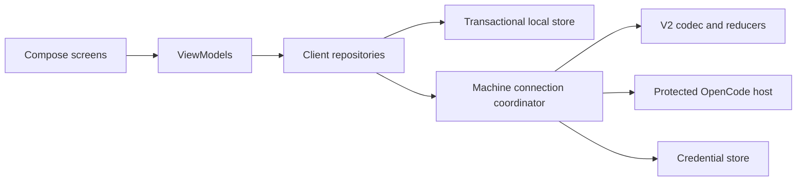

# Architecture — native OpenCode Android client

Status: architecture contract with connected candidate implementation, 2026-09-27. Room/Keystore storage, command and SSE transport, recovery coordination and native host/session/request/changes screens are implemented. Interim platform and real-HTTPS native checks passed; the forthcoming [connected report](evidence/M3/connected/REPORT.md) records the integrated evidence and remaining gates. Full final verification, physical-phone acceptance and remote-tunnel acceptance remain pending. Requirements below remain binding where their full failure matrix is not yet proved.

Read alongside the controlling [delivery plan](../PLAN.md) and [upstream reuse](../UPSTREAM-REUSE.md). Source baseline: OpenCode `b471c2b4495747353af768fbf2e0790c9d820ce2`; a development commit, not the accepted runtime release.

## Boundaries and dependencies

The phone is a controller and cached view. Each machine owns its repositories, execution, sessions and model credentials. A switched machine is a different destination, never a session migration. Initial assumption: one user with multiple machines.

Start with three Gradle modules rather than a module per screen:

| Module | Responsibility | Dependency rule |
|---|---|---|
| `:app` | Compose theme, navigation, feature packages, ViewModels, dependency wiring, Android lifecycle | Depends on `:client`; can consume `:protocol` domain types through explicit mapping |
| `:client` | Machine connections, repositories, SQLite persistence, credentials, synchronization, command admission | Depends on `:protocol`; no Compose or navigation dependency |
| `:protocol` | V2 wire DTOs, decoding, typed IDs, pure reducers and protocol fixtures | No Android UI, database or secure-storage dependency |

Proposed stack: Compose, Kotlin coroutines/Flow, a single HTTP client with SSE support, Room for transactional local persistence, and Android Keystore-backed secret encryption. Choose maintained library versions during the toolchain spike and record exact versions in one catalog. Avoid adopting dependency-injection frameworks or extra layers until a concrete need appears.

Feature packages: connections, projects/sessions, conversation/composer, permissions, changes, settings/diagnostics. Screen code renders immutable state and emits user intents. Network calls, persistence and retry loops belong outside composables. Keep transport DTOs out of presentation state.

## Identity, state and coroutine ownership

- Generate immutable local `MachineId`; attach endpoint, display name, authentication mode and validated server metadata. A hostname is an address, not sufficient identity. Endpoint changes require explicit revalidation; never carry credentials to a new origin automatically.
- Use structured `SessionKey(machineId, sessionId)` and `ProjectKey(machineId, projectId)`. Draft and pending-command keys include machine, project/location and session (or a local new-session draft ID). Preserve the upstream distinction between project, workspace and location.
- Every command captures its immutable destination, credential generation and relevant request ID when created. No later lookup through a mutable “selected machine” field. Validate the captured generation before dispatch.
- `MachineConnectionCoordinator` owns connection jobs under a supervised, cancellable scope. One serialized session reducer owns durable state application per session. Database transactions arbitrate competing writers.
- ViewModels own screen work through their lifecycle scope; collect state with lifecycle awareness. Cancelling a screen job does not cancel remote execution. Explicit interrupt is a separate command.
- Connect active foreground destinations; cancel streams on background suspension and reconcile on return. Bound any additional machine subscriptions. Do not require a permanent background service for correctness.
- Keep connectivity, authentication, protocol compatibility, cache freshness and remote execution status separate. “Transcript visible” does not mean “host online.” Authentication failure stops retry until credentials change; transport failures use bounded exponential backoff with jitter.
- Connection loss cannot establish host sleep versus a network fault. Report unreachable/cause unknown until authoritative host status or a verified instance identity supports a restart/interruption claim. Do not invent a boot-identity field absent from the supported protocol.
- Partition memory caches by machine. Logout/removal cancels relevant jobs before clearing credentials; pending sends never reroute to another host. Removing a machine with unsent work requires a clear preserve/discard choice.

## V2 adapter contract

Paths below originated in pinned source research and are refined by official 1.18.32 runtime evidence. The connected adapter reads legacy `/global/health` for `healthy` and the exact version, then uses the supported V2 contract. `/api/health` alone returns only health; unknown API GETs can return HTML with status 200. Neither a successful status nor reachability establishes compatibility. Unknown/different versions and invalid responses fail closed; credentials remain bound to the confirmed HTTPS origin.

| Operation | Pinned contract / source path under `references/opencode/` |
|---|---|
| Compatibility probe | `GET /global/health` reports health/version in the pinned runtime; require exactly `1.18.32`. `/api/health` alone cannot admit a connection. No V2 fallback on probe failure |
| List/create/read sessions | `GET/POST /api/session`, `GET /api/session/:sessionID`; `packages/protocol/src/groups/session.ts` |
| Read run status | `GET /api/session/active`; same source. Reports execution owned by the current process, not job durability across restart |
| Send prompt | `POST /api/session/:sessionID/prompt`; same source. Optional message ID and `SessionInput.Admitted` response; idempotency is unproven |
| Durable recovery | `GET /api/session/:sessionID/history?after=…` and `/event?after=…`; same source. History returns durable events and `hasMore`; cursor is an exclusive aggregate sequence |
| Live transient updates | `GET /api/event`; `packages/protocol/src/groups/event.ts`, `packages/server/src/handlers/event.ts`. No replay cursor may be inferred |
| Authoritative message/context repair | `GET /api/session/:sessionID/message/:messageID` and `/context`; session group. Context is after last compaction, not complete historical transcript |
| Pending permissions and reply | `GET /api/session/:sessionID/permission`, `POST /api/session/:sessionID/permission/:requestID/reply`; `packages/protocol/src/groups/permission.ts` |
| Interrupt | `POST /api/session/:sessionID/interrupt`; session group. Acceptance is not proof the host finished stopping |

Session creation, model/agent catalogs, pending questions/replies and bounded changes reads are mapped in the implemented transport; see [session transport evidence](evidence/M1/session-transport/REPORT.md). The connected UI integrates these boundaries, but their full native acceptance matrix remains open. Do not infer complete project/workspace discovery or file-reference support from session listing; enable only observed operations. Image attachments remain deferred. The exact-version gate is a local supported-release policy, not an invented upstream capability-negotiation endpoint.

## Synchronization and replay

Persist durable state and its cursor together. Keep transient token/tool deltas in a replaceable overlay; they cannot advance the durable cursor or become authoritative solely because they appeared on the global stream.

1. Load the scoped local projection and last committed sequence. Render it as cached until reconciliation completes.
2. Start the global live subscription for responsiveness, buffering bounded transient updates during durable recovery. If the buffer overflows, discard it and repair from authoritative state.
3. Page durable history after the saved sequence as needed, then subscribe to the session durable stream after the last committed sequence. The contract promises replay followed by live events; runtime tests must establish its boundary behavior.
4. Serialize durable events. Deduplicate by scoped durable identity/sequence and atomically commit reducer changes plus the corresponding cursor in one transaction. Do not assume public sequence numbers are contiguous unless verified.
5. Refresh run status, pending permissions and required message projections. Replace provisional overlays with authoritative results; never append a replayed text segment twice.
6. On stream loss, process restart, malformed state or missing dependencies, mark stale and reconcile again. Missing message recovery follows `packages/app/src/context/server-session.ts` and its reducer, rather than inventing missing content.

Unknown durable event types are retained as bounded diagnostics and treated as a compatibility/recovery condition: do not advance past events whose effects we cannot safely apply. Unknown optional fields may be tolerated by decoders. Bound payload sizes and memory queues. Invalid/expired cursors need a staged rebuild and atomic replacement, preserving drafts and unresolved commands separately.

Snapshot/stream ordering is an explicit spike gate: inject writes while history and projections load, then prove final state equals authoritative state. No assumption that two independent HTTP reads form one consistent snapshot.

## Durable outgoing commands

Persist user intent before dispatch. Initial release proposes explicit user send while online; automatic offline delivery is deferred. Preserve offline drafts and explain unavailable send state.

| Local state | Meaning and allowed next step |
|---|---|
| `Prepared` | Durable intent, no dispatch begun; can cancel locally |
| `Dispatching` | Record dispatch start before network I/O; a crash here becomes `OutcomeUnknown` |
| `Admitted` | Server admission is durably recorded; execution may still be queued/running |
| `OutcomeUnknown` | Response absent/ambiguous; reconcile using correlated upstream evidence, never blind retry |
| `Rejected` | Explicit server rejection proven; show typed reason and allow correction |
| `Finalized` | Local bookkeeping finished; retention cleanup is safe |

The client-generated ID is a correlation tool, not an exactly-once guarantee. Automatic resend is disabled until duplicate payload, changed payload, concurrent submission, host restart and lost-response tests establish upstream semantics. If uncertainty cannot be resolved, surface it and require an explicit duplicate-risk resend decision; lack of immediate visibility is not proof of rejection.

If acknowledgement was durably stored but deletion/cleanup fails, retry cleanup only. If the process dies after server admission but before local acknowledgement commit, recover as unknown and reconcile. Draft clearing and admission bookkeeping must not erase a newer edit. All these rules apply to destination changes during awaits.

Permissions carry exact machine/session/request identity and current upstream options. Re-fetch pending state on reconnect; stale approval is not success. Do not queue automatic approval replies for later delivery. Lost approval/interrupt responses require authoritative status checks rather than optimistic completion or generic mutation retries.

## Local persistence and recovery

Proposed tables: machines, project/session summaries, durable session projections/cursors, drafts, outgoing intents/acknowledgements, schema metadata. Keep secret material outside ordinary rows; store credential references. Persist only the history needed for usability, with bounded caches and explicit clearing controls; do not fetch or retain an entire repository by default.

Room migrations preserve drafts, unresolved sends and identity mappings. Test migration from every supported shipped schema; no destructive migration fallback. Rebuild derived caches when necessary without deleting user-authored state. On corrupt storage, fail visibly and preserve recoverable data rather than silently resetting.

Disable backup of device credentials and sensitive local app data by default; document later opt-in export separately. Keystore protects keys, not every plaintext database row automatically. Never claim whole-database encryption unless implemented and tested. Persist minimal metadata in saved UI state; process-death restoration comes from the database and authoritative host reads.

Use typed failures: `TransportUnavailable`, `TlsRejected`, `AuthenticationRequired`, `CredentialRevoked`, `ProtocolUnsupported`, `RateLimited`, `Conflict`, `RequestGone`, `OutcomeUnknown`, `StorageFailure`, `DecodeFailure`. Present actionable messages with redacted diagnostic IDs; do not expose raw server bodies or credentials. Retry safe reads selectively, honor server retry guidance where present, and never apply a universal retry interceptor to mutations.

## Connection and authentication decision gate

The candidate implements manual HTTPS Basic authentication with explicit per-machine shared-password acknowledgement and Keystore-backed storage. Synthetic-host acknowledgement is not acceptance of this limitation for Carter's actual hosts. The same-origin Update password UI uses MachineCredentialRotation: record a pending profile transition, replace the vault credential and reconcile metadata after interruption. This preserves machine identity, drafts and journal; unresolved sends block replacement. Ambiguous vault startup state fails closed until an app restart rechecks it. Local replacement is not proof the host accepts the password; Ready requires authenticated exact-version verification. Final rotation checks remain pending. If an already revoked credential prevents unresolved-send reconciliation, preserve the blocked intent and inspect the host directly; this candidate requires manual recovery and provides no automatic override/retry. See [host setup](HOST_SETUP.md).

Required before enabling remote writes: authenticated TLS, explicit origin/host confirmation, secret redaction, protected upstream access, and a tested access boundary. Per-device revocation and a restricted route surface are the target. Under PLAN D04, Carter may explicitly accept a trusted-owner MVP with a shared server credential, whole-credential rotation/re-pair and the broader authenticated OpenCode API surface documented. That is a recorded scope limitation, never implied per-device revocation or isolation. Without that decision or the target controls, the remote gate remains blocked. No public unauthenticated fallback, disabled TLS validation or credentials in query strings.

| Candidate | Accept only when | Otherwise |
|---|---|---|
| Upstream built-in pairing/access | Runtime proves native-client support, bootstrap expiry/single use, device revocation, credential rotation and required access restriction | Add the smallest missing host-side boundary |
| Named tunnel plus existing authentication | Native auth lifecycle and SSE work; target access controls hold, or Carter explicitly accepts D04's trusted-owner limitation and rotation is tested | Do not silently ship a broader/shared access mode as individually revocable pairing |
| Small companion behind named tunnel | Needed controls are absent upstream; companion enforces paired-device auth, route allowlist, limits and safe credential rotation | Keep remote connection gate blocked until tested |

A companion is conditional, not an initial architectural dependency. Its language and packaging are undecided. If required, bind OpenCode to loopback with its own authentication; companion receives only necessary privileges. An allowlist must include exact method/route combinations and exclude provider-key management and arbitrary filesystem endpoints. Session control still permits powerful code execution: this is access for the trusted owner, not a sandbox against a hostile paired user.

Named Cloudflare Tunnel is the proposed public transport; account/domain setup is a prerequisite. Cloudflare sees terminated TLS traffic; this is not end-to-end encryption. Cloudflare control credentials and model-provider secrets stay off the phone. If pairing is supported, its QR is an expiring single-use bootstrap, never a permanent reusable server password; otherwise use manual authenticated HTTPS setup. Confirm target machine/origin before exchanging credentials. Validate any upstream pairing facility rather than assuming the advertised CLI matches the pinned source.

Trust boundaries: untrusted network → authenticated ingress → optional companion → privileged OpenCode process; local phone UI/store → device credential. Treat repository text, model output, Markdown links and tool output as untrusted display content. They cannot trigger mobile actions, approvals or credential changes. External links need explicit navigation; no executable HTML/WebView bridge. Redact auth headers, prompts and repository content from routine logs. Revocation must close active access, not merely prevent the next pairing.

## Implementation gates and deferred work

1. Pin a runnable V2 release, record toolchain versions and capture real redacted fixtures. Verify schema, prompt admission, durable replay/transient interplay, permission lifecycle and interrupt.
2. Resolve connection decision with real native authentication and SSE tests through the chosen transport. Record why a companion is or is not necessary.
3. Implement one-machine vertical slice; prove send/lost-response/process-death recovery and database migration invariants before expanding features.
4. Prove two-machine isolation, long-history rendering, rate/error handling, token revocation and foreground recovery on a physical Android device. Test two observers on the same session.

Reusable future artifacts are the protocol contract, semantic tokens, fixtures and acceptance scenarios. Swift/SwiftUI is conditional on demand; do not add Kotlin Multiplatform or a shared runtime for it now. Hosted AWS/Cloudflare compute, push notifications, account services and automatic workspace transfer are deferred. A cloud machine should eventually satisfy the same host contract, with provisioning and billing handled separately.

Runtime refinement: [/api/session wait is unimplemented in the tested build; basic diff uses /vcs/diff](evidence/M1/execution/REPORT.md). Permission rejection clears other pending requests in the same session. Re-fetch pending state after any reply; do not remove only the tapped card and assume the rest remain valid.
