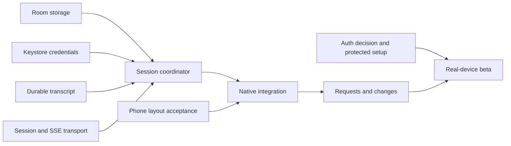

# From visual proof to a usable Android beta

Execution baseline: 2026-09-27, following merged PR #1. [PLAN.md](../PLAN.md) owns product scope; this document decomposes the remaining implementation into workstreams and integration gates. A workstream is complete only when its observations are recorded, not when files exist.

## Starting point

Verified: native debug visual proof, build/CI, machine-scoped wire types, strict JSON/SSE framing, text reconciliation, pending-request codecs, read-only HTTPS transport, and isolated real OpenCode admission/execution/request probes. The baseline has 45 JVM tests. Release remains disconnected; no remote capabilities are enabled.

First usable milestone: configure one protected host, open a real disposable project/session, send one prompt, see text and tool output, respond to a request, interrupt, and reopen the app without losing a draft or resending an uncertain command. Machine identity remains part of every key even before a second host is exposed in the UI.

## Workstreams and dependencies

| Stream | Concrete remaining work | Depends on | Acceptance |
|---|---|---|---|
| A1 · Durable storage | Room schema, host metadata, revisioned drafts, persisted outgoing intents, atomic event journal/cursor, reopen recovery | Existing identity/send rules | Actual SQLite tests: two-machine collisions; draft revision race; dispatch crash becomes unknown; transaction rollback; no duplicate dispatch |
| A2 · Credentials | Keystore AES-GCM envelopes, no-backup storage, exact origin/generation binding, rotation/deletion/error handling | Android client library setup from A1 | Actual Android tests: reopen/decrypt; tamper/missing key; wrong machine/origin/generation denied; old generation denied after rotation |
| A3 · Durable transcript | Decode the full observed text/read/question/interrupted sequences; pure tool/text/step projection; explicit unsupported semantics | Pinned event schemas and runtime captures | Captured histories replay identically; duplicate idempotence; conflicts/gaps/unknown versions do not advance safe state; resource bounds |
| B1 · Session transport | Create/read sessions, prompt admission, interrupt, pending requests/replies; cancellable durable and transient SSE; model/agent catalog | Existing HTTPS boundary and proven wire contracts | HTTPS fixture tests: exact routes, no mutation retry, lost response is unknown, cancellation closes streams, credentials never follow redirects |
| B2 · Session coordinator | Load cache; history/replay/live ordering; atomic apply/commit; refresh pending requests; background/foreground reconnect | A1 + A2 + A3 + B1 | Fault tests V02–V14: writes during recovery, crash boundaries, rejected/unknown events, acknowledgements survive cleanup failure |
| B3 · Native integration | Screen ViewModels; manual HTTPS setup; profiles/sessions; real conversation/composer; visible connection/error states | A1 + A2 + B2 and phone layout acceptance | Native flow uses real data only; restart preserves drafts; cached and ready are distinct; exact host visible for sends/replies |
| C1 · Requests and changes | Permission/question UI; authoritative refresh after reply; bounded read-only diff/file views | B1 + B2 + B3 | Two-client stale/double reply tests; no-Git/binary/large/renamed diff cases; no silent mutation retries |
| C2 · Protected setup | Settle D04; host auth/rotation tests; named tunnel guide; compatibility admission | Auth decision + B1 | Fresh Linux host walkthrough; valid HTTPS/SSE; revoked/incorrect credentials denied; supported host boundary documented |
| D · Device beta | Two hosts, Wi-Fi/cellular/offline, process death, accessibility/long histories, install/update/rollback | B + C | Physical device scenarios, reviewed layouts, installable debug artifact and honest compatibility manifest |

## Current parallel wave

A1, A2 and A3 are implemented with reviewed regression fixes; [foundation evidence](evidence/M3/foundations/REPORT.md) records their checks and limits. They were developed independently with explicit file ownership. A1 owns the Android client-library build conversion and database/schema files; A2 owns `client/security`; A3 owns `protocol/transcript`. Build-file changes are coordinated through A1. The integration owner maintains this map, checks contracts and runs combined verification. A separate review pass checks the completed boundaries with OpenCodeReview. The [next-wave transport brief](SESSION_TRANSPORT.md) records agreed ownership, route evidence, mutation outcomes and stream acceptance cases.

The journal validates and projects the supported durable event bodies before committing the complete batch and cursor in one transaction. B2 will coordinate history/live ordering and publish only committed state. Transient overlays never supply a durable cursor. Reconstructing a transcript from the journal is distinct from persisting a future materialized projection.

Profiles store only a credential reference. A2 binds the actual credential to normalized origin and generation. Cross-store rotation cannot be falsely described as one SQLite transaction: if interrupted, the coordinator must fail closed and reconcile profile/credential metadata before dispatch. No replacement origin inherits credentials automatically.

## Decisions that remain with Carter

- **D04:** shared OpenCode password over HTTPS with whole-credential rotation for the personal beta, or an additional access layer for per-device revocation. Implementation of local storage/codecs does not depend on this answer; enabling remote writes does.
- **D06:** physical Android phone and OS version for acceptance. Emulator evidence is useful but does not close the device gate.
- **M2:** acceptance of the concrete phone layouts, including keyboard and large-text states. The OpenCode V2 design direction is already settled.

No automatic cloud provisioning, provider-key management, iOS work or hosted relay enters these streams. Those remain deferred by the plan.

## Review and integration cadence

Each wave gets meaningful boundary tests, the established formatter/lint/build checks, and [OpenCodeReview](CODE_REVIEW.md) with file coverage and exact reviewed commits. Android platform storage/Keystore checks run on the isolated project emulator using synthetic values; existing hosts and unrelated emulators remain untouched. A passing wave becomes a focused PR with its evidence. Merged foundational work is not described as an app ready for real use until the one-host milestone passes.
