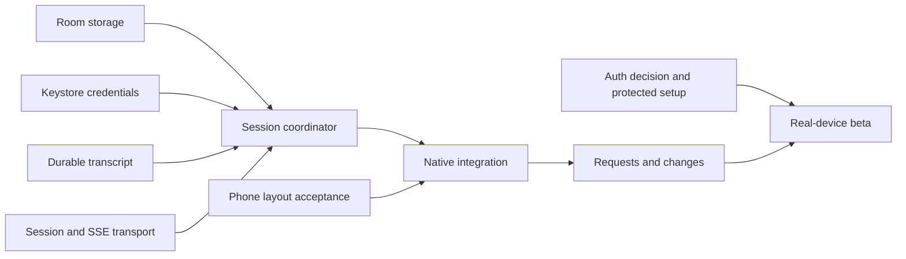

# From visual proof to a usable Android beta

Execution baseline: 2026-09-27, following merged PR #1. [PLAN.md](../PLAN.md) owns product scope; this document decomposes the remaining implementation into workstreams and integration gates. A workstream is complete only when its observations are recorded, not when files exist.

## Starting point

Implemented: connected transport/recovery, scoped state, credential replacement and 0.1.1 reading-position, answer-isolation and accessibility fixes. All 14 native fixture checks passed on Pixel 8 Pro (Android 16/API 36) over USB-forwarded HTTPS, using the unchanged 0.1.1 app APK from source `686367d65f4da6744f8988ea60b1bebfce5e620b`; installed APK hash read-back matched. The four core checks used test-helper commit `e15d30aea20533ff341748cff790c18e7f89f593` after a setup synchronization fix; the other ten used the original test APK. No application code changed. [Pixel evidence](evidence/M3/accessibility/pixel/REPORT.md) owns this validation; [Testing handoff](TESTING.md) identifies the candidate. Prior [emulator/build evidence](evidence/M3/accessibility/REPORT.md) and [0.1.0 physical/storage evidence](evidence/M3/connected/REPORT.md) retain their original artifact scope; no new 25-case storage run or current CI pass is claimed. Actual-host/tunnel, paid-provider, Wi-Fi/cellular, manual TalkBack, user layout approval, minimum-API and landscape acceptance remain open.

First usable milestone: configure one protected host, open a real disposable project/session, send one prompt, see text and tool output, respond to a request, interrupt, and reopen the app without losing a draft or resending an uncertain command. Machine identity remains part of every key even before a second host is exposed in the UI.

## Workstreams and dependencies

| Stream | Boundary and required work (status below) | Depends on | Required acceptance |
|---|---|---|---|
| A1 · Durable storage | Room schema, host metadata, revisioned drafts, persisted outgoing intents, atomic event journal/cursor, reopen recovery | Existing identity/send rules | Actual SQLite tests: two-machine collisions; draft revision race; dispatch crash becomes unknown; transaction rollback; no duplicate dispatch |
| A2 · Credentials | Keystore AES-GCM envelopes, no-backup storage, exact origin/generation binding, rotation/deletion/error handling | Android client library setup from A1 | Actual Android tests: reopen/decrypt; tamper/missing key; wrong machine/origin/generation denied; old generation denied after rotation |
| A3 · Durable transcript | Decode the full observed text/read/question/interrupted sequences; pure tool/text/step projection; explicit unsupported semantics | Pinned event schemas and runtime captures | Captured histories replay identically; duplicate idempotence; conflicts/gaps/unknown versions do not advance safe state; resource bounds |
| B1 · Session transport | Create/read sessions, prompt admission, interrupt, pending requests/replies; cancellable durable and transient SSE; model/agent catalog | Existing HTTPS boundary and proven wire contracts | HTTPS fixture tests: exact routes, no mutation retry, lost response is unknown, cancellation closes streams, credentials never follow redirects |
| B2 · Session coordinator | Load cache; history/replay/live ordering; atomic apply/commit; refresh pending requests; background/foreground reconnect | A1 + A2 + A3 + B1 | Fault tests V02–V14: writes during recovery, crash boundaries, rejected/unknown events, acknowledgements survive cleanup failure |
| B3 · Native integration | Screen ViewModels; manual HTTPS setup; profiles/sessions; real conversation/composer; visible connection/error states | A1 + A2 + B2 and phone layout acceptance | Native flow uses real data only; restart preserves drafts; cached and ready are distinct; exact host visible for sends/replies |
| C1 · Requests and changes | Permission/question UI; authoritative refresh after reply; bounded read-only diff/file views | B1 + B2 + B3 | Two-client stale/double reply tests; no-Git/binary/large/renamed diff cases; no silent mutation retries |
| C2 · Protected setup | Settle D04; host auth/rotation tests; named tunnel guide; compatibility admission | Auth decision + B1 | Fresh Linux host walkthrough; valid HTTPS/SSE; revoked/incorrect credentials denied; supported host boundary documented |
| D · Device beta | Two hosts, Wi-Fi/cellular/offline, process death, accessibility/long histories, install/update/rollback | B + C | Physical device scenarios, reviewed layouts, installable debug artifact and honest compatibility manifest |

## Current integration status

A1–A3 foundations, B1 transport, B2 coordination, B3 native integration, C1 request/changes controls and C2 manual setup/password replacement are implemented. The current 0.1.1 APK passed all 14 native Pixel fixture checks; [Pixel evidence](evidence/M3/accessibility/pixel/REPORT.md) distinguishes the core test-helper fix from unchanged application code and records the unsuccessful initial setup run. Actual-host/tunnel, paid-provider, Wi-Fi/cellular, manual TalkBack, user layout approval, minimum-API and landscape acceptance remain open.

The journal validates and projects the supported durable event bodies before committing the complete batch and cursor in one transaction. B2 coordinates history/live ordering and publishes committed state; the full fault matrix still requires recorded acceptance. Transient overlays never supply a durable cursor. Reconstructing a transcript from the journal is distinct from persisting a future materialized projection.

Profiles store only a credential reference. A2 binds the actual credential to normalized origin and generation. MachineCredentialRotation uses a pending profile record and vault reconciliation across interruption; it is not one cross-store SQLite transaction. Ambiguous vault state fails closed until an app restart rechecks it. Replacement preserves drafts/journal and is blocked by unresolved sends. Ready still requires authenticated exact-version verification; a saved password alone is not proof of access. No replacement origin inherits credentials automatically.

## Decisions that remain with Carter

- **D04:** shared-password HTTPS is the implemented testing-candidate mode with explicit per-machine acknowledgement. Acceptance for Carter's actual hosts remains pending. The same-origin Update password UI is implemented, with local rotation platform and native checks passing; actual-host rotation acceptance remains open. Unresolved sends block replacement, and revocation that prevents their reconciliation requires manual recovery. Per-device revocation requires another proven access boundary.
- **D06:** Pixel 8 Pro Android 16/API 36 passed all 14 current 0.1.1 native USB fixture checks. The 25 platform cases remain historical 0.1.0 evidence. Wi-Fi/cellular, manual TalkBack, user layout approval, minimum-API and landscape acceptance remain open.
- **M2:** acceptance of the concrete phone layouts, including keyboard and large-text states. The OpenCode V2 design direction is already settled.

No automatic cloud provisioning, provider-key management, iOS work or hosted relay enters these streams. Those remain deferred by the plan.

## Review and integration cadence

Each wave gets meaningful boundary tests, the established formatter/lint/build checks, and [OpenCodeReview](CODE_REVIEW.md) with file coverage and exact reviewed commits. Android platform storage/Keystore checks run on the isolated project emulator using synthetic values; existing hosts and unrelated emulators remain untouched. A passing wave becomes a focused PR with its evidence. Merged foundational work is not described as an app ready for real use until the one-host milestone passes.
