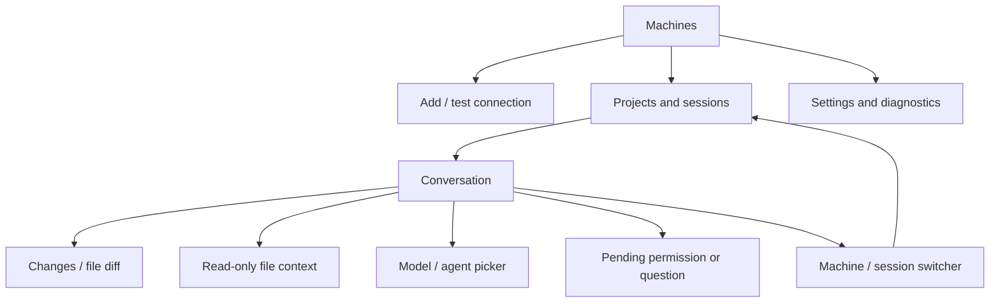

# UX specification — OpenCode V2 on Android

Status: proposed phone adaptation of the confirmed OpenCode V2 direction. M0 produced a native debug visual proof and captured screenshots; full phone-layout acceptance remains pending. The source of colors, icons and component behavior is [UPSTREAM-REUSE.md](../UPSTREAM-REUSE.md), not a generic design-system approximation.

## Experience principles

1. Know where work will happen. Machine/project context stays visible at send and approval time.
2. Read first. The conversation has clear hierarchy and minimal chrome; tool detail expands on demand.
3. Be honest about state. Cached, connecting, ready, reconnecting and unknown outcomes are distinct.
4. Preserve intent. Keyboard transitions, host switches and process death must not lose a draft or redirect an action.
5. Keep the V2 character. Copy its semantic visual language; adapt spatial arrangement for a phone.

## Screen and navigation map

On compact phones, one main content pane. Open changes as a full destination with native Back navigation; use sheets for short pickers. On wider screens, optional side-by-side conversation/review only after the phone workflow is sound. Back dismisses the keyboard/sheet according to native expectations without losing composer text. Returning from review restores scroll anchor and draft.

| Screen | Required content/actions | States that must be designed |
|---|---|---|
| Machines | User-chosen name, hostname, last successful contact, status, add/test/edit/remove | Empty; ready; unreachable; credentials needed; unsupported version |
| Setup | HTTPS address, auth method, connection test, machine confirmation; QR only if supported | Invalid URL/QR; TLS error; wrong credentials; incompatible host; expired pairing |
| Projects/sessions | Host context, project/location, recent sessions, search, new session | Empty host; no project; loading; cached; pagination/error |
| Conversation | Host/project/branch context, session title, message timeline, tools, composer | Initial; running; awaiting input; interrupted; failed; reconnecting; unknown send outcome |
| Permission/question | Exact operation/request context, host/project, upstream options | Loading; pending; submitting; already answered; no longer applicable; response uncertain |
| Changes | File names/status/counts, searchable list, unified diff | No changes; no Git; binary; deleted/renamed; large/truncated; unavailable |
| Settings/diagnostics | Appearance, hosts, cache controls, supported server/build info, redacted export | Export preview; local clearing confirmation; pending intents preventing unsafe wipe |

## Visual contract

Use the pinned explicit light/dark V2 theme blocks. Preserve layered neutral backgrounds, blue accent, status colors, restrained borders, typography hierarchy, small radii and source icon geometry. Keep one central token definition; do not scatter literal colors through screens.

| Role | Light | Dark |
|---|---|---|
| Background | `#FFFFFF` | `#161616` |
| First layer | `#FAFAFA` | `#242424` |
| Second layer | `#F2F2F2` | `#2E2E2E` |
| Primary text | `#161616` | `#FAFAFA` |
| Accent background | `#3B5CF6` | `#3B5CF6` |

Native accessibility adaptations preserve the V2 palette hierarchy while raising normal-size text to the project's 4.5:1 contrast target. The Android faint foreground uses `#6B6B6B` in light mode and `#999999` in dark mode; light success text uses `#187C3C`, and light warning text uses `#856515`. Other pinned palette values remain unchanged. `ThemeContrastTest` checks the actual foreground/surface pairs in both themes, including hints, status, warnings and active buttons.

The composer scrolls internally after four visible lines and is capped at 120dp; its full draft remains intact. With a request pending, the conversation body reserves a scrollable request area of 96–240dp, clamped to the space left above the composer. This keeps request actions reachable with enlarged text and an open keyboard; it is not a promise for every screen/font configuration. Button roles, selected catalog choices and tool disclosure states are exposed in accessibility semantics.

Inter is the upstream sans direction; verify the font's distribution license before bundling. Use a legible monospace for code. Match relative hierarchy, not desktop CSS pixels: text must scale with Android settings. Do not ship the source's tiny desktop hit areas. Project target: 48dp minimum interactive bounds, with smaller glyphs allowed inside.

Motion is short and purposeful: disclosure, sheet/navigation transitions and status changes. Use the approved fast-in/soft-out easing where appropriate, respect reduced motion and avoid pulsing/shimmering across a whole transcript. V2 has pending-tool shimmer; port only a restrained treatment and provide a static equivalent.

Contrast, large text and TalkBack require verification even when values come from upstream. Document any accessibility-driven token deviation alongside the accepted reference.

## Conversation and composer behavior

- Preserve V2's composer structure: text entry, selected context, model/agent controls and clear send/interrupt affordances. Surface only the controls the tested host contract supports.
- Text is a durable draft keyed to machine/project/session. New-session drafts have their own local key until the host session exists. Do not auto-send when a connection returns.
- Slash commands and file mentions use native lists/sheets. Provide touch controls for actions that are keyboard-only upstream. Image attachment/full shell controls are absent from beta until their deferred scope is accepted.
- Proposed Android behavior: Enter inserts a newline; a visible Send action submits. Respect IME composition. Physical-keyboard shortcuts are optional enhancements, never the only path.
- On accepted send, clear only the submitted draft revision. Preserve edits typed while admission is pending. If admission is unknown, show the pending item and keep any new draft independently editable.
- Tool rows show name, status and relevant summary; expansions preserve reading position. Initial parity follows the source's non-expandable pending row. Live tool-output expansion is an explicit later decision, not a hidden divergence.
- Follow the bottom while the user is already there. Once they scroll up, keep their anchor and offer a “new output” affordance. Streaming must not steal selection/focus or announce every token to TalkBack.
- Model/agent changes show the selected host-supported value and confirmed state; pending/failure cannot silently appear as a completed switch.
- Interrupt is distinct from disconnect. Disable repeated submission while its request is in flight; show stopping until host state confirms it. Lost responses require reconciliation.

## Permission and question behavior

Keep consequential requests readable above the composer or in a dedicated sheet, with machine and project visible. Render the upstream choices and their scope accurately. Do not rename a persistent permission grant as “Allow once.” Questions and permissions are separate request types even if they share presentation primitives.

Disable repeat taps while responding, but keep errors and recovery reachable. On reconnect, reload pending requests before offering actions. If another client already answered, show the current state and dismiss the stale action. No approving through notification actions or automatic offline queues in beta.

## Connection states and copy

| State | User-facing meaning | Available behavior |
|---|---|---|
| Cached/offline | Saved content, not a live host view | Read cached content, edit draft, retry connection |
| Connecting/authenticating | Access not yet verified | Cancel/revise setup; sending unavailable |
| Reconciling | Host reached, catching up | Read; pending decisions/mutations wait for authoritative state |
| Ready | Authenticated, compatible and current enough for the requested action | Send and other supported actions |
| Outcome unknown | A request may have been accepted | Reconcile first; no automatic resend |
| Unsupported/revoked | Requires a specific user change | Explain update/re-pair path; do not loop silent retries |

Show actionable language such as “Checking whether this message was received.” If a duplicate-risk resend becomes necessary, explain that consequence explicitly and keep the original intent visible. Raw stack traces, HTTP payloads and credential values do not belong in these flows.

## Visual acceptance in M2

Produce native screenshots for machine list, conversation idle/running, tool details, permission/question, changes and reconnect/unknown states. Use synthetic content and label the debug build. Review light/dark at a compact and a wider phone width, with keyboard open, enlarged text and edge-to-edge system insets. Record the actual test dimensions/API/device; do not invent screenshots or device results.

Compare each view against the pinned V2 source/reference capture. Record preserved elements and intentional adaptations, then Carter's accepted screenshots. An HTML approximation can help discussion but does not satisfy the native visual gate. A preview with sample data does not satisfy the real-host integration gate.
